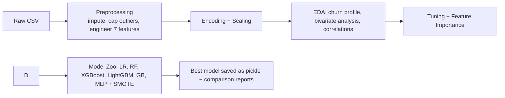

# E-Commerce Customer Churn Prediction

Predict churn for 50k e-commerce customers using behavioral, transactional, and engagement signals.

## Snapshot
| Item | Detail |
| --- | --- |
| Dataset | 50,000 customers, 25 raw features |
| Target | `Churned` (1 = churned, 0 = retained) with 28.9% positive rate |
| Engineered features | 7 additional signals built during preprocessing (frequency, engagement, value, recency) |
| Quick win | Gradient Boosting F1 = 0.848, ROC-AUC = 0.928 on a fast scikit-learn pipeline |

## Workflow


## Project Structure
| Path | Purpose |
| --- | --- |
| `Notebooks/01_Data_Preprocessing.ipynb` | Cleans data, handles missing values, caps outliers, engineers 7 features, scales, and creates train/test splits. |
| `Notebooks/02_Exploratory_Data_Analysis.ipynb` | Visual EDA, churn segmentation, correlation checks, feature importance quick scan, and exports `EDA_Summary_Report.csv`. |
| `Notebooks/03_Model_Training.ipynb` | Trains seven models with SMOTE, compares metrics, tunes the leader, saves the best model artifact. |
| `Data/ecommerce_customer_churn_dataset.csv` | Raw dataset (50k rows x 25 columns). |
| `Data/Preprocessed Data/preprocessed_data.csv` | Fully processed dataset ready for modeling. |
| `Data/Train/`, `Data/Test/` | Stratified splits generated in preprocessing. |

## Data and Features
- Core columns include demographics (`Age`, `Gender`, `Country`), engagement (`Login_Frequency`, `Session_Duration_Avg`, `Pages_Per_Session`), shopping behavior (`Total_Purchases`, `Average_Order_Value`, `Cart_Abandonment_Rate`), value (`Lifetime_Value`, `Credit_Balance`), and lifecycle (`Membership_Years`, `Signup_Quarter`).
- Target: `Churned` (binary).
- City was dropped in modeling to avoid high-cardinality noise.

Key engineered signals from preprocessing:
| Feature | What it captures |
| --- | --- |
| `Purchase_Frequency` | Buying cadence for each customer. |
| `Engagement_Score` | Composite activity score across on-site actions. |
| `Shopping_Behavior_Score` | Basket and browsing consistency. |
| `Value_Category` | Customer value segmentation. |
| `Recency_Score` | Time since last purchase. |
| `Satisfaction_Proxy` | Proxy sentiment from interactions. |
| `Activity_Level` | Buckets of overall activity. |

## Model Performance (fresh run)
Quick scikit-learn baseline (City dropped, class-weight balanced, 80/20 stratified split):

| Model | Accuracy | Precision | Recall | F1 | ROC-AUC |
| --- | --- | --- | --- | --- | --- |
| Logistic Regression | 0.716 | 0.505 | 0.734 | 0.599 | 0.790 |
| Random Forest | 0.914 | 0.928 | 0.763 | 0.837 | 0.926 |
| Gradient Boosting | 0.920 | 0.939 | 0.773 | 0.848 | 0.928 |

The notebooks extend this by training seven models (LogReg, Decision Tree, Random Forest, XGBoost, LightGBM, Gradient Boosting, MLP) with SMOTE balancing and hyperparameter tuning for the top performer before saving the best model.

## Getting Started
1) Python 3.10+ recommended.  
2) Create an environment and install deps:
```powershell
python -m venv .venv
.venv\\Scripts\\Activate
pip install -r requirements.txt  # or install key libs below
```
If no requirements file is present, install: `pandas numpy scikit-learn imbalanced-learn xgboost lightgbm matplotlib seaborn plotly joblib`.

3) Open the notebooks in order:
   - `01_Data_Preprocessing.ipynb`
   - `02_Exploratory_Data_Analysis.ipynb`
   - `03_Model_Training.ipynb`

## Reproduce a quick baseline from the CLI
This snippet mirrors the baseline table above and runs in under a minute:
```python
import pandas as pd
from sklearn.model_selection import train_test_split
from sklearn.compose import ColumnTransformer
from sklearn.preprocessing import OneHotEncoder, StandardScaler
from sklearn.impute import SimpleImputer
from sklearn.pipeline import Pipeline
from sklearn.linear_model import LogisticRegression
from sklearn.ensemble import RandomForestClassifier, GradientBoostingClassifier
from sklearn.metrics import accuracy_score, precision_score, recall_score, f1_score, roc_auc_score

df = pd.read_csv("Data/ecommerce_customer_churn_dataset.csv").drop(columns=["City"])
y = df["Churned"]
X = df.drop(columns=["Churned"])
cat = X.select_dtypes(include=["object"]).columns
num = [c for c in X.columns if c not in cat]
pre = ColumnTransformer([
    ("num", Pipeline([("imputer", SimpleImputer(strategy="median")), ("scaler", StandardScaler())]), num),
    ("cat", Pipeline([("imputer", SimpleImputer(strategy="most_frequent")), ("enc", OneHotEncoder(handle_unknown="ignore"))]), cat),
])
models = {
    "LogReg": LogisticRegression(max_iter=1000, class_weight="balanced"),
    "RandomForest": RandomForestClassifier(n_estimators=200, class_weight="balanced", random_state=42, n_jobs=-1),
    "GradBoost": GradientBoostingClassifier(random_state=42),
}
X_train, X_test, y_train, y_test = train_test_split(X, y, test_size=0.2, stratify=y, random_state=42)
for name, m in models.items():
    pipe = Pipeline([("prep", pre), ("model", m)])
    pipe.fit(X_train, y_train)
    pred = pipe.predict(X_test)
    proba = pipe.predict_proba(X_test)[:, 1]
    print(name, {
        "acc": round(accuracy_score(y_test, pred), 3),
        "prec": round(precision_score(y_test, pred), 3),
        "rec": round(recall_score(y_test, pred), 3),
        "f1": round(f1_score(y_test, pred), 3),
        "roc": round(roc_auc_score(y_test, proba), 3),
    })
```

## Outputs and Reports
- Preprocessed datasets and feature names: `Data/Preprocessed Data/`, `Data/Train/`, `Data/Test/`.
- EDA summary export: `EDA_Summary_Report.csv` (saved by the EDA notebook).
- Model comparison and tuned best model saved in `Notebooks/03_Model_Training.ipynb` run (pickles saved alongside the notebook when executed).

## Next Steps
- Try the full model suite in `03_Model_Training.ipynb` and export the best model for deployment.
- Extend feature engineering (customer lifetime stages, marketing touchpoints) and rerun the notebooks.
- Track experiment runs with MLflow or Weights & Biases if you want reproducible benchmarking.
